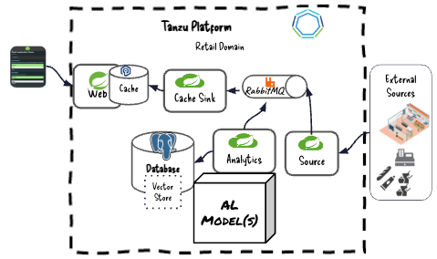

Setup

Create Services

````shell
cf create-service genai local-llama-33-70b-instruct retail-ai-chat
cf create-service genai prod-embedding-nomic-text retail-ai-embedding
cf create-service genai local-mistrall-small-32-2506-gpu retail-ai-mistrall
````

```shell
cf target -s data-demo
cf push valkey-console-app -f deployments/cloud/cloudFoundry/apps/valkey-console-app/valkey-console-app.yaml  -b java_buildpack_offline -p applications/valkey-console-app/target/valkey-console-app-0.0.2.jar
cf push jdbc-sql-console-app -f deployments/cloud/cloudFoundry/apps/jdbc-sql-console-app/jdbc-sql-console-app.yaml -b java_buildpack_offline -p applications/jdbc-sql-console-app/target/jdbc-sql-console-app-0.0.4.jar
cf target -s data-flow-demo
cf push scdf-valkey-console-app -f deployments/cloud/cloudFoundry/apps/valkey-console-app/valkey-console-app.yaml  -b java_buildpack_offline -p applications/valkey-console-app/target/valkey-console-app-0.0.2.jar
cf push scdf-jdbc-sql-console-app -f deployments/cloud/cloudFoundry/apps/jdbc-sql-console-app/jdbc-sql-console-app.yaml -b java_buildpack_offline -p applications/jdbc-sql-console-app/target/jdbc-sql-console-app-0.0.4.jar
```

Clean Postgres in console

```sql
delete from retail.products;
delete from retail.customer_orders;
delete from retail.vector_store;
```


Delete ValKey Data


Delete Applications

```shell
cf delete retail-analytics-app -f
cf delete retail-cache-sink-app  -f
cf delete retail-source-app   -f
cf delete retail-web-app  -f
```


***********

Push Web App

```shell
cf push retail-web-app -f deployments/cloud/cloudFoundry/apps/retail-web-app/retail-web-app.yaml -b java_buildpack_offline -p applications/web-app/target/web-app-0.2.0.jar &
```

Source Application

```shell
cf push retail-source-app -f deployments/cloud/cloudFoundry/apps/retail-source-app/retail-source-app.yaml  -b java_buildpack_offline -p applications/source-app/target/source-app-0.2.0.jar &
```

Analytics

```shell
cf push retail-analytics-app -f deployments/cloud/cloudFoundry/apps/retail-analytics-app/retail-analytics-app-postgres.yaml  -b java_buildpack_offline -p applications/analytics-app/target/analytics-app-0.2.0.jar &
```

Start Cache Sink Application

```shell

cf push retail-cache-sink-app -f deployments/cloud/cloudFoundry/apps/retail-cache-sink-app/retail-cache-sink-app.yaml  -b java_buildpack_offline -p applications/cache-sink-app/target/cache-sink-app-0.2.0.jar &
```


Manifest retail-web-app.yaml

```yaml
applications:
  - name: retail-web-app
    memory: 1400M
    log-rate-limit-per-second: -1
    services:
      - retail-caching
    env:
      spring.profiles.active: valkey
      #      spring.profiles.active: gemfire
      JBP_CONFIG_OPEN_JDK_JRE: '{ jre: { version: 17.+}}'
      retail.customer.id: 'nyla'
```

Show Create Services in 
```shell
cf target -s data-flow-demo
```


View Services

```shell
cf services
```

Review how applications
Reviews Services

retail-source-app Manifest

```yaml
applications:
  - name: retail-source-app
    memory: 1400M
    log-rate-limit-per-second: -1
    services:
      - retail-messaging
    env:
      JBP_CONFIG_OPEN_JDK_JRE: '{ jre: { version: 17.+}}'
```

retail-analytics-app

```yaml
applications:
  - name: retail-analytics-app
    memory: 1400M
    log-rate-limit-per-second: -1
    services:
      - retail-messaging
      - retail-sql
      - retail-ai-chat
      - retail-ai-embedding
    env:
      JBP_CONFIG_OPEN_JDK_JRE: '{ jre: { version: 17.+}}'
      spring.profiles.active: 'openai,postgres,rabbit-product-quorum'
```

retail-cache-sink-app

```yaml
applications:
  - name: retail-cache-sink-app
    memory: 1400M
    log-rate-limit-per-second: -1
    services:
      - retail-messaging
      - retail-caching
    env:
      JBP_CONFIG_OPEN_JDK_JRE: '{ jre: { version: 17.+}}'
      SPRING_PROFILES_ACTIVE: 'valkey'
#      SPRING_PROFILES_ACTIVE: 'gemfire'
```


View Applications 

```shell
cf target -s data-demo
```

```shell
cf apps
```

Open Apps Manager


- Open Web App
- Open Source


Load Products


Open RabbitMQ

Submit Orders

Submit Reviews

Submit Context

Submit Reviews

Open Logs in App Metrics

Search Meatloaf Review


-------------

View Applications

```shell
cf target -s data-demo
```


Access SCDF


```scdf
retail-stream=retail-source --server.port=80 | retail-analytics  --spring.profiles.active=openai,postgres,product-quorum | cache-sink --spring.profiles.active=valkey
retail-app=retail-web-app --server.port=80 --spring.profiles.active=valkey --retail.customer.id=nyla
```

Retail Web Application

```properties
app.retail-web-app.retail.customer.id=nyla
app.retail-web-app.server.port=80
app.retail-web-app.spring.profiles.active=valkey
deployer.retail-web-app.bootVersion=3
deployer.retail-web-app.cloudfoundry.env.JBP_CONFIG_OPEN_JDK_JRE={jre: {version: 17.+}}
deployer.retail-web-app.cloudfoundry.services=retail-caching
```

Retail Stream
```properties
app.cache-sink.spring.profiles.active=valkey
app.retail-analytics.spring.profiles.active=openai,postgres,product-quorum
app.retail-source.server.port=80
deployer.retail-source.bootVersion=3
deployer.retail-source.cloudfoundry.env.JBP_CONFIG_OPEN_JDK_JRE={jre: {version: 17.+}}
deployer.retail-source.cloudfoundry.services=retail-sql,retail-ai-chat,retail-ai-embedding
deployer.retail-source.cloudfoundry.memory=1400m
deployer.retail-analytics.bootVersion=3
deployer.retail-analytics.cloudfoundry.env.JBP_CONFIG_OPEN_JDK_JRE={jre: {version: 17.+}}
deployer.retail-analytics.cloudfoundry.services=retail-sql,retail-ai-chat,retail-ai-embedding
deployer.retail-analytics.cloudfoundry.memory=1400m
deployer.cache-sink.bootVersion=3
deployer.cache-sink.cloudfoundry.env.JBP_CONFIG_OPEN_JDK_JRE={jre: {version: 17.+}}
deployer.cache-sink.cloudfoundry.services=retail-caching
deployer.cache-sink.cloudfoundry.memory=1400m
```


Scaling

```csv
"1","sam","sku1","2"
"2","sam","sku1","2"
"3","sam","sku1","2"
"4","sam","sku1","2"
"5","sam","sku1","2"
"6","sam","sku1","2"
"7","sam","sku1","2"
"8","sam","sku1","2"
"9","sam","sku1","2"
"10","sam","sku1","2"
"11","sam","sku1","2"
"12","sam","sku1","2"
"13","sam","sku1","2"
"14","sam","sku1","2"
"15","sam","sku1","2"
"16","sam","sku1","2"
"17","sam","sku1","2"
"18","sam","sku1","2"
"19","sam","sku1","2"
"20","sam","sku1","2"
"21","sam","sku1","2"
"22","sam","sku1","2"
"23","sam","sku1","2"
"24","sam","sku1","2"
"25","sam","sku1","2"
"26","sam","sku1","2"
"27","sam","sku1","2"
"28","sam","sku1","2"
"29","sam","sku1","2"
"30","sam","sku1","2"
"31","sam","sku1","2"
"32","sam","sku1","2"
"33","sam","sku1","2"
"34","sam","sku1","2"
"35","sam","sku1","2"
"36","sam","sku1","2"
"37","sam","sku1","2"
"38","sam","sku1","2"
"39","sam","sku1","2"
"40","sam","sku1","2"
"41","sam","sku1","2"
"42","sam","sku1","2"
"43","sam","sku1","2"
"44","sam","sku1","2"
"45","sam","sku1","2"
"46","sam","sku1","2"
"47","sam","sku1","2"
"48","sam","sku1","2"
"49","sam","sku1","2"
"50","sam","sku1","2"
"51","sam","sku1","2"
"52","sam","sku1","2"
"53","sam","sku1","2"
"54","sam","sku1","2"
"55","sam","sku1","2"
"56","sam","sku1","2"
"57","sam","sku1","2"
"58","sam","sku1","2"
"59","sam","sku1","2"
"60","sam","sku1","2"
"61","sam","sku1","2"
"62","sam","sku1","2"
"63","sam","sku1","2"
"64","sam","sku1","2"
"65","sam","sku1","2"
"66","sam","sku1","2"
"67","sam","sku1","2"
"68","sam","sku1","2"
"69","sam","sku1","2"
"70","sam","sku1","2"
"71","sam","sku1","2"
"72","sam","sku1","2"
"73","sam","sku1","2"
"74","sam","sku1","2"
"75","sam","sku1","2"
"76","sam","sku1","2"
"77","sam","sku1","2"
"78","sam","sku1","2"
"79","sam","sku1","2"
"80","sam","sku1","2"
"81","sam","sku1","2"
"82","sam","sku1","2"
"83","sam","sku1","2"
"84","sam","sku1","2"
"85","sam","sku1","2"
"86","sam","sku1","2"
"87","sam","sku1","2"
"88","sam","sku1","2"
"89","sam","sku1","2"
"90","sam","sku1","2"
"91","sam","sku1","2"
"92","sam","sku1","2"
"93","sam","sku1","2"
"94","sam","sku1","2"
"95","sam","sku1","2"
"96","sam","sku1","2"
"97","sam","sku1","2"
"98","sam","sku1","2"
"99","sam","sku1","2"
"100","sam","sku1","2"
```


Queues

retail.customer.orders.retail-analytics-app