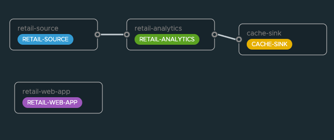

```shell
open http://localhost:9393/dashboard
```


In S3

```properties
processor.retail-analytics=https://tanzu-scdf-data.s3.us-east-1.amazonaws.com/analytics-app-0.2.0.jar
processor.retail-analytics.bootVersion=3
sink.cache-sink=https://tanzu-scdf-data.s3.us-east-1.amazonaws.com/cache-sink-app-0.2.0.jar
sink.cache-sink.bootVersion=3
source.retail-source=https://tanzu-scdf-data.s3.us-east-1.amazonaws.com/source-app-0.1.0-SNAPSHOT.jar
source.retail-source.bootVersion=3
app.retail-web-app=https://tanzu-scdf-data.s3.us-east-1.amazonaws.com/web-app-0.2.0.jar
app.retail-web-app.bootVersion=3
```

Local

```properties
processor.retail-analytics=file:///Users/Projects/solutions/Spring/dev/spring-modern-data-architecture/applications/analytics-app/target/analytics-app-0.2.0.jar
processor.retail-analytics.bootVersion=3
sink.cache-sink=file:///Users/Projects/solutions/Spring/dev/spring-modern-data-architecture/applications/cache-sink-app/target/cache-sink-app-0.2.0.jar
sink.cache-sink.bootVersion=3
source.retail-source=file:///Users/Projects/solutions/Spring/dev/spring-modern-data-architecture/applications/source-app/target/source-app-0.1.0-SNAPSHOT.jar
source.retail-source.bootVersion=3
app.retail-web-app=file:///Users/Projects/solutions/Spring/dev/spring-modern-data-architecture/applications/web-app/target/web-app-0.2.0.jar
app.retail-web-app.bootVersion=3
```

Create Stream



```scdf
retail-stream=retail-source --server.port=8393 | retail-analytics  --spring.profiles.active=ollama,postgres,local-postgres,product-quorum | cache-sink --spring.profiles.active=valkey
retail-app=retail-web-app --server.port=8394 --spring.profiles.active=valkey --retail.customer.id=nyla
```